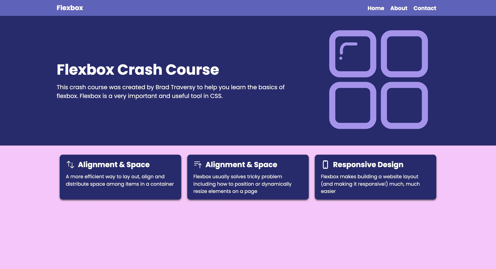

# Landing Page Made With Flexbox

This landing page was built to study basic front end structure and different concepts within flexbox. The foundation came from a tutorial by Brad Traversy, but some parts of the code were simplified and color choices were changed. The images and SVG files are public domain and differ from the tutorial used to build the basic layout.

## Features

- Color palette came from [SheCodes] (https://www.shecodes.io/palettes/1519)
- Tech Stack: HTML and CSS
- Code was simplified to be cleaner and apply to more areas
- Landing page is responsive when screen is resized below 800px
- On mobile, the navbar becomes a hamburger menu

## Images

Here is the full screen, desktop version of the landing page

Here's another image of a smaller version of the same landpage when the screen is resized
